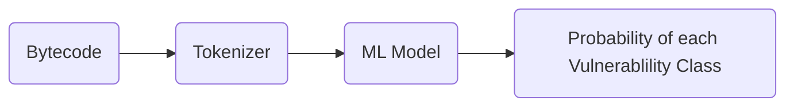

# **Online analyzing of contract bytecode**

## Usage of server

The server is made on Flask, and listens on port `1234`. If you have other applications listening on the specified port, change port number in [app.py](/app.py) file.

Make sure to install the dependencies mentioned in the [requirements.txt](/requirements.txt) file. The `model` packages contains a pretrained model. The dataset for the training process (preprocessed_data.csv) can be downloaded from [here](https://drive.google.com/drive/folders/1F09oo3pISNk-UOvYMbwmqmAfH_eVG2bH?usp=sharing).

## ML Model Overview (Training)

<a href="https://drive.google.com/uc?export=view&id=1e3kyoYp7irHAs2VwFiPlbZgdv0uIA6Se">

## Preprocessing Data
The data in the train_data.csv file has gone through a process of converting its bytecode to assembly code using the disassemble_hex function from the pyevmasm library. Afterwards, newline characters and "STOP words" were removed from the assembly code using the NLTK library. Finally, a list of all contract addresses was extracted from the code. 

Since the data in the train_data.csv file had multiple categories assigned to each data point (i.e. it was multi-labeled), one hot encoding was used to convert these multiple category values into a binary representation. The one hot encoding process involves creating a binary vector for each category value in the data, and setting the corresponding index of the vector to 1 for each data point that belongs to that category. This results in a high-dimensional, sparse binary representation of the original categorical data.

## Parameters

**MAX_WORDS** = 41000
This is the maximum number of words of opcode to be used. 
To set this value, we found of mean of the length of opcode of smart contracts. 

**SEQ_LEN** = 250
This is the maximum length of each token in assembly code of smart contract which set to 250 as it is a general practice in large LSTM model.

**EMBEDDING_LAYER_DIMENSION** = 100
 This is feature representation of dimensions of embedding layer .

## DataFlow (During Prediction)

